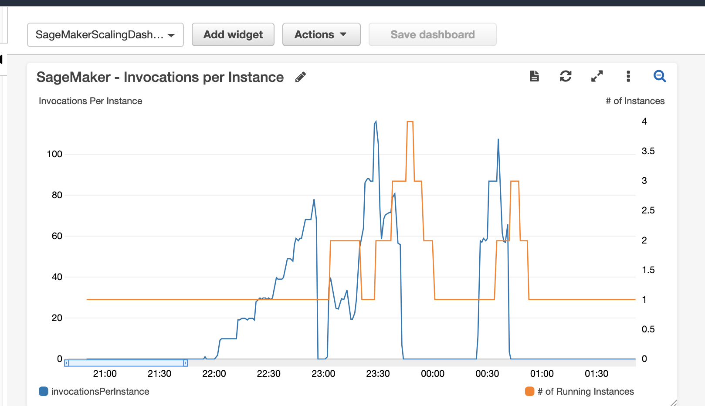

# SageMaker Step Scaling

This project demonstrates how you can create a custom step-scaling auto-scaling policy for your hosted SageMaker endpoint. 

## Background

SageMaker endpoints provide out-of-the-box [target-tracking](https://docs.aws.amazon.com/autoscaling/application/userguide/application-auto-scaling-target-tracking.html) autoscaling for the [InvocationsPerInstance](https://docs.aws.amazon.com/sagemaker/latest/dg/monitoring-cloudwatch.html) metric.

With a **target-tracking** policy, you simply set a metric and desired metric value, and AWS will scale up or down for you to track close to that metric. 

This works well, but in certain cases, you may want to use a different metric or otherwise modify the default behavior of this built-in tracking. To do that, you need to create a custom [Step Scaling Policy](https://docs.aws.amazon.com/autoscaling/application/userguide/application-auto-scaling-step-scaling-policies.html). **Step-scaling** requires a bit more work to set up, but gives you more flexibility in the scaling events.

## How it works

Behind the scenes, Amazon SageMaker endpoints use [AWS Application Auto-scaling](https://docs.aws.amazon.com/autoscaling/application/userguide/what-is-application-auto-scaling.html) (a separate service) to scale SageMaker endpoints. 

Application Auto-scaling supports both target-tracking and step-scaling policies. However, at this time (Aug 2020), the SageMaker web UI only shows options for target tracking policies.

If you want to use step-scaling with SageMaker, you instead need to use the Application Auto-scaling APIs, CLI, or CloudFormation. This project shows you the CloudFormation approach.

## Architecture

The included CloudFormation Template creates the following:

* **SageMakerEndpointScalingTarget** - this registers your existing SageMaker endpoint with the AWS Application Auto-scaling service as a candidate for auto-scaling. 

* **SageMakerDemoScalingPolicy** - this is the AWS Application Auto-Scaling step policy that defines when and by how much we should change the number of instances in our SageMaker auto-scaling group. Note that the "steps" in this policy are **relative** to the CloudWatch Alarm we will associate to this policy. For example, if the policy states that we should add 1 instance with an upper and lower bound of 0 to 20, that means that you should **add** 0 and 20 to the associated alarm's threshold value to know when it will scale. To make this easier to use, I associate an alarm that tracks Invocations Per Instance on the endpoint and I set the alarm threshold value to ">= 0", which means that the step values in the policy match the actual metric values. You can modify this as needed. 

* **SageMakerDemoScalingAlarm** - this is a CloudWatch Alarm that enters the alarm state when the SageMaker endpoint's **InvocationsPerInstance** metric is greater than or equal to zero. In other words, this alarm would always be in alarm state. This may sound odd, but this is because I wanted a single scaling policy and alarm to handle both scale-up and scale-down actions. It's probably visually cleaner to break this out into separate alarms/policies, but this was my faster interim approach.

* **SageMakerScalingDashboard** - a CloudWatch dashboard that graphs your endpoint's invocations per instance and total number of running instances over time. The dashboard looks like this:

  

  In the example above, you can see that the number of running instances (orange line) scales up with traffic, but you can also see that the timing is a bit too late to match demand. This suggests that I should either modify the alarm and/or scaling policy to be more aggressive.

## Prerequisites

1. Pre-existing SageMaker endpoint deployed.
2. AWS CLI installed and configured from the machine where you're running this project. 
3. Optionally, Node v7+ installed (if you use the load test script)

## Deployment

1. clone this repository

2. Edit `deploy.sh` and specify your SageMaker endpoint and variant name:

  ```sh
  # ./deploy.sh
  SAGEMAKER_ENDPOINT_NAME=<Your_Endpoint_Name>
  SAGEMAKER_VARIANT_NAME=<Your_Endpoint_Variant_Name>
  ```

3. Run `./deploy.sh` to launch a CloudFormation template (see **Resources** section)

4. Optionally, you can run the `invoke-endpoint.js` script to send requests to your endpoint; the request rate increases over time so that you can test the auto-scaling policy. This is a very basic example and you may need to adjust the script based on your endpoint requirements. If you want to use it, you can: 

  1. Install node dependencies: 

    ```sh
    npm install
    ```

  2. Open `invoke-endpoint.js` and edit the endpoint and variant name:

    ```js
    const ENDPOINT_NAME = 'object-detection-2020-07-13-19-26-21-768';
    const VARIANT_NAME = 'AllTraffic';
    ```

    and, optionally edit the info about the test rate:

    ```js
    var requestsPerMinute = 60;
    var minutesPerStepSize = 5;
    var requestStepSize = 30;
    var numberOfSteps = 10;
    ```

  3. Run the script:

    ```js
    node invoke-endpoint.js
    ```